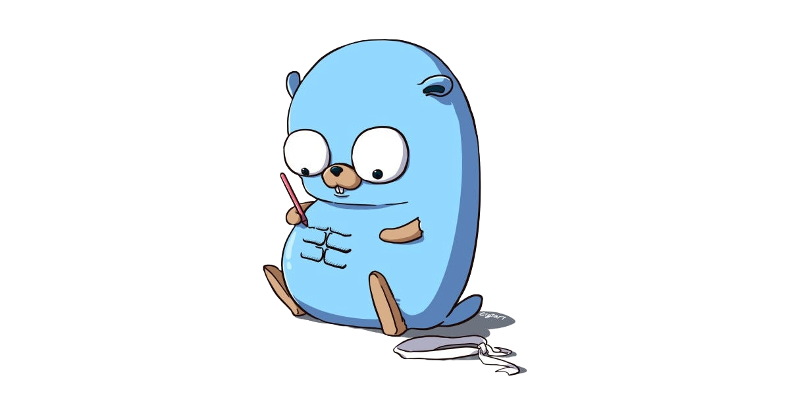

<h1 align="center">🤗 Hello! I'm Renê Cardozo</h1>

<h3 align="center">

💼 Senior Software Engineer [@TRACTIAN](https://tractian.com)

</h3>

<h2 align="center">

[Golang SP Meetup](https://www.meetup.com/golangbr)

</h2>

  

